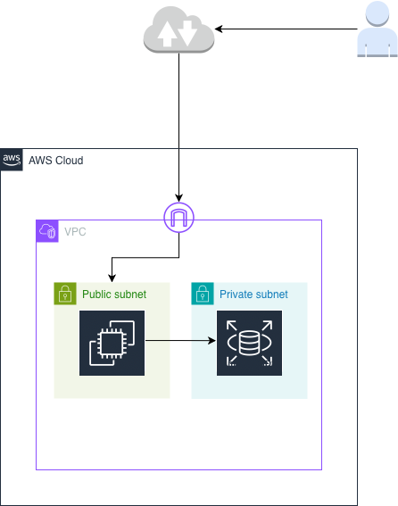
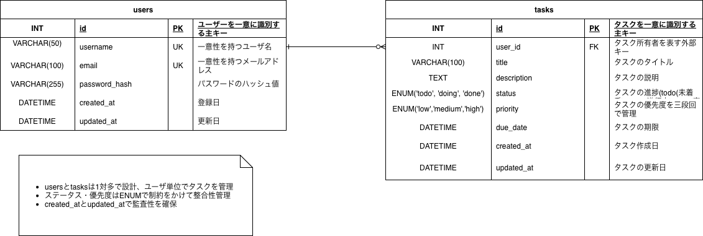

# Task Manager

## Overview
タスク管理を行うWebアプリケーション。  
ユーザーごとにタスクの作成・読取・更新・削除（CRUD）を行う。

---

## Features
- ユーザー認証（JWT）
- タスクCRUD
- ステータス管理（todo / doing / done）
- 優先度管理（low / medium / high）

---

## Tech Stack
- Backend: FastAPI
- DB: MySQL (RDS)
- ORM: SQLAlchemy
- Infra: AWS (EC2, RDS)
- Others: Docker（任意）

---

## Architecture


---

## ER Diagram


---

## API Endpoints

### Auth
- POST /register
- POST /login

### Tasks
- GET /tasks
- POST /tasks
- PUT /tasks/{id}
- DELETE /tasks/{id}

---

## Demo
http://15.134.202.120/docs

---

## Setup

### 1. Clone
```bash
git clone https://github.com/shinkai23/task-manager-by-aws.git
cd task-manager-by-aws
```

### 2. Virtual Environment
```bash
python -m venv venv
source venv/bin/activate
```

### 3. Install
```bash
pip install -r requirements.txt
```

### 4. Run
```
uvicorn app.main:app --reload
```

---
### Directory Structure

```コード
app/
 ├── models/
 ├── schemas/
 ├── routers/
 ├── services/
 └── main.py

docs/
 ├── er-diagram.png
 ├── db-design.md
 └── schema.sql
```
---
### Database Design

[db-design.md](../develop/docs/db-design.md#L1-20)

### Future Improvements
- Cognito導入
- S3によるファイル管理
- CI/CD構築
- コンテナ化（ECS）

### Author 
https://github.com/shinkai23
